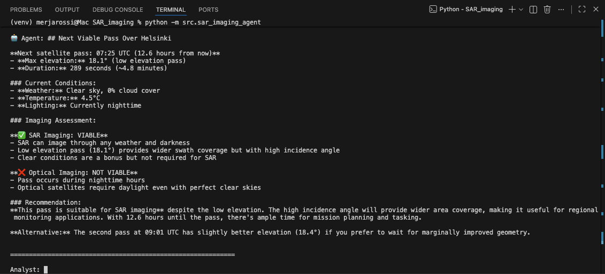
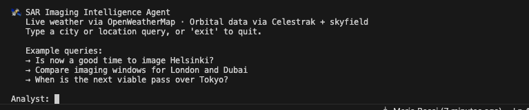

# SAR Imaging Intelligence Agent 🛰️

An AI-powered satellite imaging intelligence agent. The agent chains multiple tools together to determine optimal imaging windows for any location on Earth (as long as it is available on OpenWeatherMap.org).

---

## What It Does

Given a natural language query like *"Is now a good time to image Helsinki?"*, the agent autonomously:

1. **Fetches live weather** — cloud cover, temperature, and daylight status via OpenWeatherMap
2. **Computes real satellite passes** — using live TLE orbital data from Celestrak and the SGP4 propagator model via skyfield
3. **Assesses imaging suitability** — determines whether SAR or optical imaging is viable for the upcoming pass

### SAR vs Optical
- **SAR** (Synthetic Aperture Radar) penetrates clouds, smoke, and total darkness — it works in any weather, day or night
- **Optical** requires clear skies (≤20% cloud cover) and daylight

---

## Example Queries

```
Is now a good time to image Helsinki?
Compare imaging windows for London and Dubai
When is the next viable pass over Tokyo?
What are the SAR conditions over Warsaw right now?
```

---

## Screenshots





---

## Setup

### 1. Clone the repository

```bash
git clone https://github.com/MerjaR/SAR_imaging.git
cd SAR_imaging
```

### 2. Create and activate a virtual environment

```bash
python3 -m venv venv

# Mac/Linux:
source venv/bin/activate

# Windows:
venv\Scripts\activate
```

### 3. Install dependencies

```bash
pip install -r requirements.txt
```

### 4. Set up your `.env` file

Create a `.env` file in the root of the repository with the following keys:

```
ANTHROPIC_API_KEY=your-anthropic-api-key-here
OPENWEATHERMAP_API_KEY=your-openweathermap-api-key-here
```

**Getting your API keys:**

- **Anthropic API key** — sign up or log in at [console.anthropic.com](https://console.anthropic.com), navigate to API Keys, and create a new key. You will need to add credits under Plans & Billing.
- **OpenWeatherMap API key** — create a free account at [openweathermap.org](https://openweathermap.org), then find your key under your profile → API Keys. Note that new keys can take 10-15 minutes to activate after signup.

### 5. Verify your setup

```bash
python verify_setup.py
```

All checks should show ✅ before running the agent.

---

## Running the Agent

```bash
python -m src.sar_imaging_agent
```

The agent runs in interactive mode — type any location query at the prompt and press Enter. Type `exit` or `quit` to stop.

---

## Project Structure

```
.
├── .env                    ← your API keys (not committed)
├── .gitignore
├── README.md
├── requirements.txt
├── verify_setup.py         ← checks your setup is correct
├── src/
│   └── sar_imaging_agent.py  ← the agent
└── utils/
    ├── __init__.py
    └── helpers.py          ← shared utilities
```

---

## How It Works

The agent uses Claude's tool use feature to chain three tools together autonomously — Claude decides which tools to call and in what order, without any hardcoded logic controlling the flow.

```
User query
    │
    ▼
get_weather(city)
    │  Returns: temp, cloud cover %, daylight, lat, lon
    ▼
get_satellite_passes(lat, lon, city)
    │  Returns: next pass time, elevation, duration
    │  Source: Live TLE data from Celestrak + skyfield SGP4
    ▼
assess_imaging_window(cloud_cover, minutes_to_pass, elevation, daylight)
    │  Returns: SAR/optical suitability, recommendation, urgency
    ▼
Final analyst brief
```

---

## Dependencies

| Package | Purpose |
|---|---|
| `anthropic` | Claude API client |
| `skyfield` | Satellite orbital mechanics (SGP4) |
| `requests` | HTTP calls to weather and TLE APIs |
| `python-dotenv` | Loading `.env` file |

---

## Data Sources

- **Weather** — [OpenWeatherMap API](https://openweathermap.org/api) (free tier)
- **Orbital data** — [Celestrak](https://celestrak.org) (free, no auth required)
- **Propagator** — SGP4 via [skyfield](https://rhodesmill.org/skyfield/), the same model used by NORAD